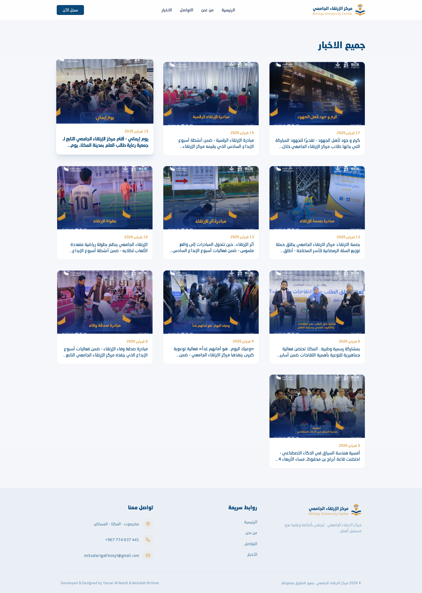

# Airtiqa — مركز الارتقاء الجامعي

> A modern, bilingual web platform for Airtiqa University Center — empowering students through ethics, knowledge, and community.

<br />

## Live Demo

**[airtiqa.vercel.app](https://airtiqa.vercel.app/)**

<br />

## Preview

<table>
  <tr>
    <td></td>
    <td></td>
  </tr>
  <tr>
    <td align="center">Hero</td>
    <td align="center">News</td>
  </tr>
</table>

<br />

## Features

- Bilingual interface — Arabic (RTL) & English
- Fully responsive across all screen sizes
- Smooth scroll experience powered by Lenis
- Dynamic news feed with image cards and dates
- Interactive hero section with animated content
- Swiper-powered sliders for media and highlights
- Fast SPA navigation via React Router

<br />

## Tech Stack

| Layer       | Technology                          |
|-------------|--------------------------------------|
| Framework   | React 19                             |
| Bundler     | Vite 7                               |
| Styling     | Tailwind CSS v4                      |
| Routing     | React Router DOM v7                  |
| Slider      | Swiper                               |
| Smooth Scroll | Lenis                              |
| Deployment  | Vercel                               |

<br />

## Project Structure

```
airtiqa/
├── public/
├── src/
│   ├── assets/
│   ├── components/
│   ├── constants/
│   ├── pages/
│   ├── App.jsx
│   ├── main.jsx
│   └── index.css
├── index.html
└── vite.config.js
```

<br />

## Getting Started

```bash
# Install dependencies
npm install

# Start development server
npm run dev

# Build for production
npm run build
```

<br />

---

<p align="center">
  Developed & Designed by <strong>Yasser Al-Mahdi & Abdullah Brishan</strong> · © 2026 Airtiqa University Center
</p>
